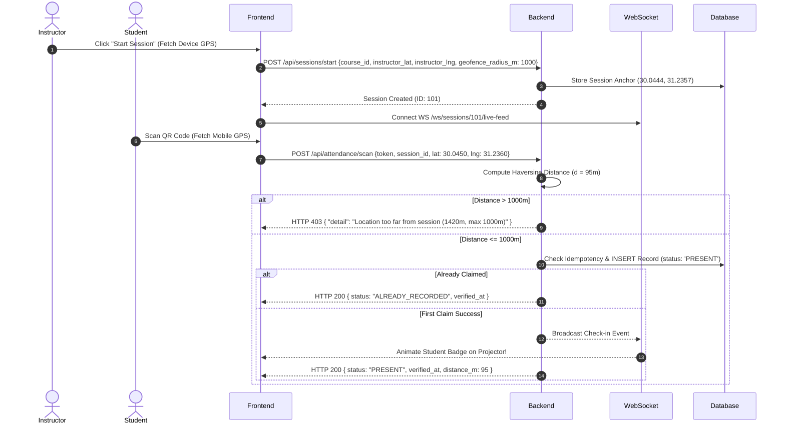

# Attendify Lite: Master System Specification & Design System
**Project Codename**: Attendify Lite  
**Document Version**: 2.2.0  
**Target Architecture**: React 19 (Vite) + FastAPI (Python 3.10+) + Supabase PostgreSQL  

---

## 1. Executive Overview & Design Philosophy

**Attendify Lite** is a high-performance, mobile-first classroom management and attendance tracking platform. It replaces heavy machine learning / facial recognition dependencies with cryptographically signed, rotating QR codes paired with role-based user accounts and dynamic instructor-anchored geofencing.

### Key Architectural Tenets:
1. **Zero-Friction Access**: Students scan and claim attendance in < 3 seconds using any smartphone browser.
2. **Cryptographic Anti-Spoofing**: Rotating HMAC-SHA256 QR tokens with 15–30 second lifetimes eliminate remote picture/screenshot sharing.
3. **Dynamic Instructor-Anchored Geofencing**: When starting a session, the instructor's device location becomes the live anchor point ($1\,\text{km}$ default radius).
4. **Realistic Security Posture**: Clearly defined Threat Model separating off-campus remote sharing prevention from in-room proxy attendance.
5. **Aesthetic Excellence**: Built with a state-of-the-art dark mode UI, glassmorphism, dynamic animations, and intuitive micro-interactions.
6. **Real-time Synchronization**: WebSockets / Server-Sent Events (SSE) feed live attendee counts directly to classroom projectors without polling.
7. **100% Free Hosting Ready**: Zero heavy C++ binary requirements—runs seamlessly on Vercel, Netlify, Render, Koyeb, and Supabase.

---

## 2. Design System & UI Specifications

### 2.1 Color Palette & Tokens

Attendify Lite uses a modern, deep dark-mode visual aesthetic with high-contrast status colors.

```css
:root {
  /* Brand Primary (Deep Electric Indigo) */
  --primary: #6366f1;
  --primary-hover: #4f46e5;
  --primary-glow: rgba(99, 102, 241, 0.25);

  /* Backgrounds & Surfaces */
  --bg-app: #090d16;
  --bg-card: rgba(18, 24, 38, 0.75);
  --bg-card-hover: rgba(26, 34, 53, 0.85);
  --bg-input: #111726;

  /* Borders & Dividers */
  --border-subtle: rgba(255, 255, 255, 0.08);
  --border-active: rgba(99, 102, 241, 0.5);

  /* Functional Status Colors */
  --status-present: #10b981;     /* Emerald Green (Marked Present) */
  --status-late: #f59e0b;        /* Amber Gold (Late Join) */
  --status-absent: #ef4444;      /* Rose Red (Absent) */
  --status-info: #3b82f6;        /* Sky Blue (Active Session) */

  /* Text Colors */
  --text-main: #f8fafc;
  --text-muted: #94a3b8;
  --text-subtle: #64748b;
}
```

### 2.2 Typography Hierarchy

* **Primary Font**: `Inter` or `Geist Variable` from Google Fonts.
* **Monospace Font** (for Join Codes & Tokens): `JetBrains Mono` or `Fira Code`.

| Level | Size | Weight | Usage |
| :--- | :--- | :--- | :--- |
| **Display 1** | `2.5rem (40px)` | Bold (700) | Live QR Session Counter |
| **Heading 1** | `1.875rem (30px)` | SemiBold (600) | Page Titles, Dashboard Headers |
| **Heading 2** | `1.5rem (24px)` | Medium (500) | Course Card Titles, Modal Headers |
| **Body** | `1.0rem (16px)` | Regular (400) | Form Inputs, Roster Tables |
| **Small / Badge** | `0.875rem (14px)` | Medium (500) | Status Pills, Time Timestamps |
| **Code / Token** | `1.25rem (20px)` | Monospace (700) | 8-Character Course Join Codes |

---

## 3. Database Schema (Production PostgreSQL Specification)

```sql
-- Enable UUID extension
CREATE EXTENSION IF NOT EXISTS "uuid-ossp";

-- 1. Users Table
CREATE TABLE public.users (
    id BIGINT GENERATED ALWAYS AS IDENTITY PRIMARY KEY,
    name VARCHAR(100) NOT NULL,
    email VARCHAR(255) NOT NULL UNIQUE,
    hashed_password VARCHAR(255) NOT NULL,
    role VARCHAR(20) NOT NULL CHECK (role IN ('INSTRUCTOR', 'STUDENT')),
    created_at TIMESTAMPTZ NOT NULL DEFAULT NOW()
);

-- 2. Revoked / Blacklisted Tokens (JWT Revocation Path)
CREATE TABLE public.revoked_tokens (
    id BIGINT GENERATED ALWAYS AS IDENTITY PRIMARY KEY,
    jti VARCHAR(255) NOT NULL UNIQUE,
    revoked_at TIMESTAMPTZ NOT NULL DEFAULT NOW(),
    expires_at TIMESTAMPTZ NOT NULL
);

-- 3. Courses Table
CREATE TABLE public.courses (
    id BIGINT GENERATED ALWAYS AS IDENTITY PRIMARY KEY,
    name VARCHAR(150) NOT NULL,
    code VARCHAR(50) NOT NULL UNIQUE,
    join_code VARCHAR(8) NOT NULL UNIQUE,
    instructor_id BIGINT NOT NULL REFERENCES public.users(id) ON DELETE CASCADE,
    created_at TIMESTAMPTZ NOT NULL DEFAULT NOW()
);

-- 4. Course Enrollments Junction Table
CREATE TABLE public.course_enrollments (
    id BIGINT GENERATED ALWAYS AS IDENTITY PRIMARY KEY,
    course_id BIGINT NOT NULL REFERENCES public.courses(id) ON DELETE CASCADE,
    student_id BIGINT NOT NULL REFERENCES public.users(id) ON DELETE CASCADE,
    enrolled_at TIMESTAMPTZ NOT NULL DEFAULT NOW(),
    CONSTRAINT uq_course_student UNIQUE (course_id, student_id)
);

-- 5. Attendance Sessions Table (Includes Dynamic Instructor Geofence Anchor)
CREATE TABLE public.sessions (
    id BIGINT GENERATED ALWAYS AS IDENTITY PRIMARY KEY,
    course_id BIGINT NOT NULL REFERENCES public.courses(id) ON DELETE CASCADE,
    session_secret VARCHAR(64) NOT NULL,
    late_threshold_minutes INT NOT NULL DEFAULT 10,
    instructor_lat DOUBLE PRECISION,                     -- Live Anchor Latitude
    instructor_lng DOUBLE PRECISION,                     -- Live Anchor Longitude
    geofence_radius_m INT NOT NULL DEFAULT 1000,         -- 1000m (1km) Campus Radius
    started_at TIMESTAMPTZ NOT NULL DEFAULT NOW(),
    ended_at TIMESTAMPTZ,
    is_active BOOLEAN NOT NULL DEFAULT TRUE
);

-- 6. Attendance Records Table
CREATE TABLE public.attendance (
    id BIGINT GENERATED ALWAYS AS IDENTITY PRIMARY KEY,
    session_id BIGINT NOT NULL REFERENCES public.sessions(id) ON DELETE CASCADE,
    student_id BIGINT NOT NULL REFERENCES public.users(id) ON DELETE CASCADE,
    status VARCHAR(20) NOT NULL DEFAULT 'PRESENT' CHECK (status IN ('PRESENT', 'LATE', 'EXCUSED')),
    student_lat DOUBLE PRECISION,                        -- Scanned Geolocation
    student_lng DOUBLE PRECISION,
    distance_from_instructor_m DOUBLE PRECISION,         -- Computed Distance
    verified_at TIMESTAMPTZ NOT NULL DEFAULT NOW(),
    CONSTRAINT uq_session_student_attendance UNIQUE (session_id, student_id)
);

-- Performance Indexes
CREATE INDEX idx_users_email ON public.users(email);
CREATE INDEX idx_courses_join_code ON public.courses(join_code);
CREATE INDEX idx_sessions_course ON public.sessions(course_id);
CREATE INDEX idx_sessions_active ON public.sessions(is_active);
CREATE INDEX idx_attendance_session ON public.attendance(session_id);
CREATE INDEX idx_attendance_student ON public.attendance(student_id);
```

---

## 4. Cryptographic Engine, Geofencing & Threat Analysis

### 4.1 Dynamic Instructor Geofence Anchor Mechanism

1. **Session Anchor Creation**: When an instructor clicks **"Start Session"**, the frontend captures their device location once via `navigator.geolocation.getCurrentPosition()` and posts `instructor_lat` and `instructor_lng` to `/api/sessions/start`.
2. **Student Claim Verification**: When a student scans the QR code, the mobile browser captures `student_lat` and `student_lng` and posts them to `/api/attendance/scan`.
3. **Haversine Distance Formula**:
   The backend computes distance $d$ in meters between student and instructor:
   $$\Delta \phi = \text{lat}_2 - \text{lat}_1, \quad \Delta \lambda = \text{lng}_2 - \text{lng}_1$$
   $$a = \sin^2\left(\frac{\Delta \phi}{2}\right) + \cos(\text{lat}_1)\cos(\text{lat}_2)\sin^2\left(\frac{\Delta \lambda}{2}\right)$$
   $$d = 2 \cdot R \cdot \arcsin(\sqrt{a}) \quad \text{where } R = 6,371,000 \text{ meters}$$

If $d > \text{geofence\_radius\_m}$ (default $1000\,\text{m}$), the claim is rejected with `HTTP 403 Forbidden`:
`{ "detail": "Location too far from session (1420m, max 1000m)" }`

---

### 4.2 Realistic Threat Model & Security Posture

It is critical to distinguish what this two-factor verification architecture defends against versus its limitations:

```
+-----------------------------------------------------------------------------------------+
|                                    THREAT MODEL MATRIX                                  |
+-----------------------------------------------------------------------------------------+
| Threat Vector                  | Mitigated By                | Protection Status        |
+--------------------------------+-----------------------------+--------------------------+
| Off-Campus Remote QR Sharing   | 1000m Geofence Check        | FULLY PREVENTED          |
| (Student in another city/dorm) |                             |                          |
+--------------------------------+-----------------------------+--------------------------+
| Screenshot Texting             | 15-second Rotating HMAC     | FULLY PREVENTED          |
| (Student sends photo)          | Token                       |                          |
+--------------------------------+-----------------------------+--------------------------+
| In-Class Friend Proxy          | Requires physical attendance| Partially Mitigated      |
| (Friend scans inside room)     | or phone swap in room       | (Needs ML / Biometrics)  |
+--------------------------------+-----------------------------+--------------------------+
| DevTools Mock Location         | Server Haversine Check      | Raises Barrier for Casual|
| (Faking GPS in DevTools)       |                             | Cheating                 |
+--------------------------------+-----------------------------+--------------------------+
```

> **Why a 1 km (1000m) Default Geofence?**
> * **Zero Building Setup**: No manual configuration of building lat/long required.
> * **Eliminates Indoor GPS Jitter**: Concrete walls and indoor attenuation cause $20\text{--}50\,\text{m}$ of GPS error. A $1000\,\text{m}$ boundary eliminates false rejections for legitimate students inside classrooms while guaranteeing off-campus remote sharing is impossible.

---

### 4.3 Graceful Location Permission Fallback

If a student's browser blocks location access:
* **UI Guidance**: The mobile scanner presents an explicit helper modal: `"Location access is required to confirm campus presence. Please enable location permissions in browser settings."`
* **Optional Instructor Override**: Scans without location payloads can be recorded with `status = 'FLAGGED_UNVERIFIED'` for instructor manual review rather than hard-failing without explanation.



---

## 5. Complete API Endpoint Specifications

### 5.1 Authentication (`/api/auth`)
* `POST /api/auth/register` — Register User (`name`, `email`, `password`, `role`).
* `POST /api/auth/login` — Returns Short-Lived Access Token (15 mins) + Refresh Token (7 days).
* `POST /api/auth/refresh` — Issue new short-lived access token using valid refresh token.
* `POST /api/auth/logout` — Revoke active token (adds JWT ID `jti` to `revoked_tokens` table).
* `GET /api/auth/me` — Fetch active user profile.

### 5.2 Courses (`/api/courses`)
* `POST /api/courses` — Create Course (Instructor).
* `GET /api/courses` — List user's courses.
* `POST /api/courses/join` — Join course via 8-character `join_code` (Student).
* `GET /api/courses/{id}/roster` — Fetch enrolled roster with overall student attendance rates (Instructor).
* `POST /api/courses/{id}/import-roster` — Bulk CSV import of student emails for auto-enrollment (Instructor).
* `GET /api/courses/{id}/export-matrix` — Download course-wide attendance matrix (CSV).

### 5.3 Sessions (`/api/sessions`)
* `POST /api/sessions/start` — Start new attendance session (`course_id`, `instructor_lat`, `instructor_lng`, `geofence_radius_m`).
* `GET /api/sessions/{id}/qr` — Fetch rotating QR code token (Base64).
* `POST /api/sessions/{id}/end` — **Close Active Session** (Flips `is_active = false`, sets `ended_at = NOW()`).
* `GET /api/sessions/{id}/export` — **Export Session CSV** (`student_name`, `email`, `verified_at`, `status`, `distance_m`).

### 5.4 Attendance & Student Stats (`/api/attendance`, `/api/students`)
* `POST /api/attendance/scan` — Submit QR payload (`session_id`, `token`, `lat`, `lng`).  
  * **Idempotent Handling**: Re-scanning returns HTTP 200 with `{ "status": "ALREADY_RECORDED", "message": "Attendance already recorded for this session" }`.
  * **Geofence Check**: Distance $> \text{geofence\_radius\_m}$ returns HTTP 403 (`"Location too far from session (1420m, max 1000m)"`).
* `GET /api/students/attendance-history` — Fetch student's global and per-course attendance stats (e.g. `94% Overall`).
* `WS /ws/sessions/{id}/live-feed` — WebSocket endpoint pushing real-time check-in events to instructor projector screen.

---

## 6. Directory Structure & File Organization

```
attendify-lite/
├── app/                          # FastAPI Backend
│   ├── api/                      # Route Handlers
│   │   ├── auth.py               # Auth, Refresh, Revocation
│   │   ├── courses.py            # Course CRUD, Roster, Bulk CSV
│   │   ├── sessions.py           # Start/End Session, Dynamic Geofence Anchor, CSV Export
│   │   ├── attendance.py         # Scan QR (Idempotent), Rates, Haversine Check
│   │   └── websockets.py         # Realtime Projector Feed WS
│   ├── core/                     # Configurations & Security
│   │   ├── config.py             # Env Variables (Settings)
│   │   ├── security.py           # JWT Hashing, Revocation Checks
│   │   ├── rate_limiter.py       # Slowapi Rate Limiting
│   │   └── qr_engine.py          # HMAC-SHA256 & Haversine Distance Engine
│   ├── db/                       # Database Setup
│   │   └── database.py           # SQLAlchemy Engine & Session
│   ├── models/                   # SQLAlchemy Models
│   │   └── models.py             # User, Course, Session, Attendance, RevokedToken
│   ├── schemas/                  # Pydantic Request/Response DTOs
│   │   └── schemas.py
│   └── main.py                   # FastAPI Application Entrypoint
│
├── frontend/                     # React 19 + Vite Frontend
│   ├── src/
│   │   ├── components/           # Reusable UI Components
│   │   │   ├── ui/               # Buttons, Cards, Inputs, Badges
│   │   │   ├── QRProjector.tsx   # Rotating QR + WebSocket Live Roster
│   │   │   └── QRScanner.tsx     # Mobile Camera + Geolocation Capture
│   │   ├── pages/                # Application Views
│   │   │   ├── AuthPage.tsx      # Login / Signup
│   │   │   ├── InstructorDash.tsx# Courses, Roster, Bulk Import
│   │   │   ├── LiveSession.tsx   # Projector View with WS Stream
│   │   │   └── StudentDash.tsx   # Attendance Stats & Scan FAB
│   │   ├── services/             # Axios / Fetch API Clients
│   │   │   └── api.ts
│   │   ├── types/                # TypeScript Interfaces
│   │   │   └── database.types.ts
│   │   ├── App.tsx               # Router Setup
│   │   └── main.tsx              # React Root
│   ├── index.html
│   ├── package.json
│   ├── tailwind.config.js
│   └── vite.config.ts
│
├── Dockerfile                    # Containerization Spec
├── requirements.txt              # Python Dependencies
└── README.md
```

---

## 7. Step-by-Step 100% Free Cloud Deployment Setup

| Component | Host | Free Tier Plan |
| :--- | :--- | :--- |
| **Frontend** | **Vercel** | Unlimited Bandwidth, Global CDN, SSL |
| **Backend** | **Koyeb / Render / Hugging Face** | Python FastAPI Container |
| **Database** | **Supabase** | 500MB PostgreSQL Database |

### Environment Variables Template (`.env.example`)

```env
# Backend Environment (.env.example)
SECRET_KEY=REPLACE_WITH_YOUR_32_CHARACTER_SECRET_KEY_HERE
DATABASE_URL=postgresql://postgres:<YOUR_PASSWORD>@db.<YOUR_PROJECT_REF>.supabase.co:5432/postgres
JWT_ALGORITHM=HS256
ACCESS_TOKEN_EXPIRE_MINUTES=15
REFRESH_TOKEN_EXPIRE_DAYS=7
ALLOWED_ORIGINS=https://your-frontend.vercel.app,http://localhost:5173

# Frontend Environment (frontend/.env.example)
VITE_API_BASE_URL=https://your-backend.koyeb.app
VITE_WS_BASE_URL=wss://your-backend.koyeb.app
```
